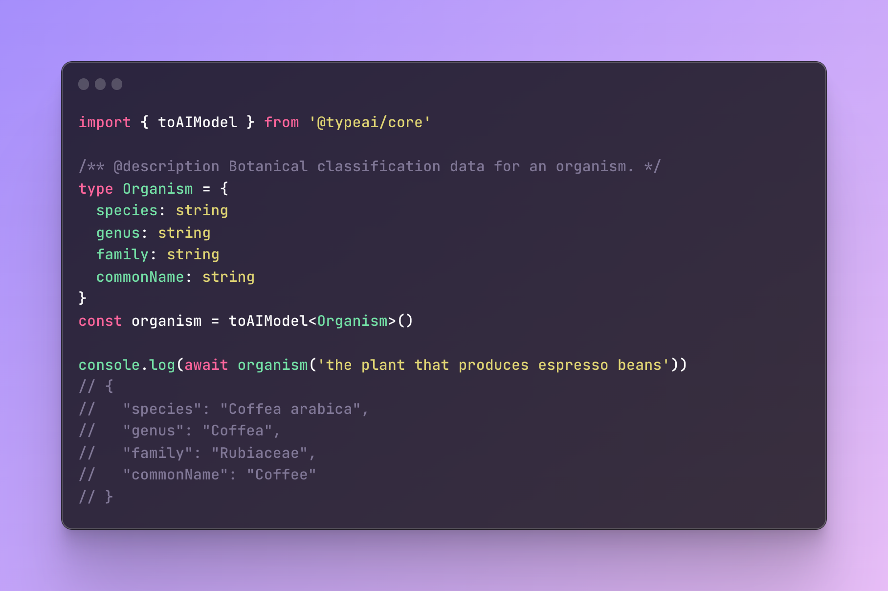

# TypeAI: An AI Engineering Framework for TypeScript

<p align="center">
  
  <a href="https://www.npmjs.com/package/@typeai/core">
    
  </a>
  <a href="https://github.com/TypeAI-dev/typeai/actions/workflows/ci.yml">
    
  </a>
  <a href="https://github.com/TypeAI-dev/typeai/blob/main/LICENSE.txt">
	
  </a>
</p>



TypeAI is a toolkit for building AI-enabled apps using TypeScript that makes things look so simple it seems like magic. More importantly, it makes building with LLMs "feel" like ordinary code with low impedance mismatch.

An example:

```typescript
import { toAIFunction } from '@typeai/core'

/** @description Given `text`, returns a number between 1 (positive) and -1 (negative) indicating its sentiment score. */
function sentimentSpec(text: string): number | void {}
const sentiment = toAIFunction(sentimentSpec)

const score = await sentiment('That was surprisingly easy!')
```

Just specify your types and function signatures as you naturally would, and TypeAI will generate the appropriate implementation respecting your type declarations. No loading separate schema files, no prompt engineering, and no manually writing JSON Schema representations of your functions.

### Contents

1. [Installation](#installation)
2. [Usage](#usage)
   - **Using TypeAI to generate functionality**
     - AI Models
     - AI Functions
     - AI Classifiers
   - **Using TypeAI to expose functionality to an LLM**
     - AI "Tool Functions"
3. [How does it work?](#how)
4. [Future Direction & TODOs](#future)
5. [Acknowledgements](#acknowledgements)
6. [License](#license)

### Support

Follow me on Twitter: 

## <a name="installation"></a>Installation

[DeepKit](<[url](https://github.com/deepkit/deepkit-framework)>) is required in order to provide runtime type information on your functions and types.

```sh
npm install @typeai/core @deepkit/core
```

> NOTE: For now, automatic extraction of JSDoc @description tags requires these
> forked npm package builds @deepkit/type and @deepkit/type-compiler

```sh
npm install @deepkit/type@npm:@jefflaporte/deepkit-type@1.0.1-alpha.97-jl
npm install --save-dev @deepkit/type-compiler@npm:@jefflaporte/deepkit-type-compiler@1.0.1-alpha.97-jl
# Bash
./node_modules/.bin/deepkit-type-install
# PowerShell
pwsh ./node_modules/.bin/deepkit-type-install.ps1
```

_tsconfig.json_

```js
// tsconfig.json
{
  "compilerOptions": {
    // ...

    // Note: DeepKit says that experimentalDecorators is not necessary when using @deepkit/type,
    // but I have found that deepkit's typeOf() does not always work with TypeScript > 4.9
    // without experimentalDecorators set.
    "experimentalDecorators": true
  },
  "reflection": true
}
```

TypeAI makes connecting your functions and types to AI APIs like OpenAI's chat completion endpoints lightweight by using runtime type reflection on TypeScript code to generate the JSON schema required by OpenAI's function calling feature, and by handling function dispatch and result delivery to the LLM.

## <a name="usage"></a>Usage

TypeAI currently provides two main areas of functionality:

- Generation of "magic" AI-backed functions
  - AI Models
  - AI Functions
  - AI Classifiers
- Generation and handing of LLM tool function glue
  - AI "Tool Functions"

### AI Functions

To create an AI-backed function, write a stub function and pass it to `toAIFunction()`, which will generate an AI-backed function with the desired behaviour.

```typescript
/** @description Given `text`, returns a number between 1 (positive) and -1 (negative) indicating its sentiment score. */
function sentimentSpec(text: string): number | void {}
const sentiment = toAIFunction(sentimentSpec)

const score = await sentiment('That was surprisingly easy!')
```

Functions with complex input and output TypeScript types work too. Here's a more interesting example:

```typescript
type Patient = {
  name: string
  age: number
  isSmoker: boolean
}
type Diagnosis = {
  condition: string
  diagnosisDate: Date
  stage?: string
  type?: string
  histology?: string
  complications?: string
}
type Treatment = {
  name: string
  startDate: Date
  endDate?: Date
}
type Medication = Treatment & {
  dose?: string
}
type BloodTest = {
  name: string
  result: string
  testDate: Date
}
type PatientData = {
  patient: Patient
  diagnoses: Diagnosis[]
  treatments: Treatment | Medication[]
  bloodTests: BloodTest[]
}

/** @description Returns a PatientData record generate from the content of doctorsNotes notes. */
function generateElectronicHealthRecordSpec(input: string): PatientData | void {}
const generateElectronicHealthRecord = toAIFunction(generateElectronicHealthRecordSpec, {
  model: 'gpt-4',
})
```

#### TypeScript enums to AI-backed Classifiers

```typescript
enum AppRouteEnum {
  USER_PROFILE = '/user-profile',
  SEARCH = '/search',
  NOTIFICATIONS = '/notifications',
  SETTINGS = '/settings',
  HELP = '/help',
  SUPPORT_CHAT = '/support-chat',
  DOCS = '/docs',
  PROJECTS = '/projects',
  WORKSPACES = '/workspaces',
}
const AppRoute = toAIClassifier(AppRouteEnum)

const appRouteRes = await AppRoute('I need to talk to somebody about billing')
```

### AI "Tool Function" Helpers

An AI tool function is a function provided to an LLM for it's own use in generating answers.

Say you have a function and want to provide it's functionality to OpenAI's LLM for use with their **_Function Calling_** feature.

_See:_

- [OpenAI Blog: Function calling and other API updates](https://openai.com/blog/function-calling-and-other-api-updates)
- [OpenAI API: Create Chat Completion](https://platform.openai.com/docs/api-reference/chat/create)

TypeAI provides two functions that make exposing your function to GPT-3.5/4 and handling the resulting function call requests from GPT-3/4 transparent:

```typescript
ToolFunction.from<R>(fn: (...args: any[]) => R): ToolFunction
function handleToolUse(
  openAIClient: OpenAIApi,
  messages: ChatCompletionRequestMessage[],
  originalRequest: CreateChatCompletionRequest,
  responseData: CreateChatCompletionResponse,
  options?: { model?: string, registry?: SchemaRegistry },
): Promise<CreateChatCompletionResponse | undefined>
```

They can be used like this:

```typescript
import {
  OpenAIApi,
  Configuration,
  CreateChatCompletionRequest,
  ChatCompletionRequestMessage,
  ChatCompletionRequestMessageRoleEnum,
} from 'openai'
import { ToolFunction, handleToolUse } from '@typeai/core'
import { getCurrentWeather } from 'yourModule'

// Init OpenAI client
const configuration = new Configuration({ apiKey: process.env.OPENAI_API_KEY })
const openai = new OpenAIApi(configuration)

// Generate JSON Schema for function and dependent types
const getCurrentWeatherTool = ToolFunction.from(getCurrentWeather)

// Run a chat completion sequence
const messages: ChatCompletionRequestMessage[] = [
  {
    role: ChatCompletionRequestMessageRoleEnum.User,
    content: "What's the weather like in Boston? Say it like a weather reporter.",
  },
]
const request: CreateChatCompletionRequest = {
  model: 'gpt-3.5-turbo',
  messages,
  functions: [getCurrentWeatherTool.schema],
  stream: false,
  max_tokens: 1000,
}
const responseWithFnUse = await openai.createChatCompletion(ccr)

// Transparently handle any LLM calls to your function.
// handleToolUse() returns OpenAI's final response after
// any/all function calls have been completed
const responseData = await handleToolUse(openai, messages, request, responseWithFnUse.data)
const result = responseData?.choices[0].message

/*
Good afternoon, Boston! This is your weather reporter bringing you the latest
updates. Currently, we're experiencing a pleasant temperature of 82 degrees Celsius. The sky is a mix of sunshine and clouds, making for a beautiful day. However, there is a 25% chance of precipitation, so you might want to keep an umbrella handy. Additionally, the atmospheric pressure is at 25 mmHg. Overall, it's a great day to get outside and enjoy the city. Stay safe and have a wonderful time!
*/
```

## <a name="how"></a>How does it work?

TypeAI uses TypeScript runtime type info provided by `@deepkit/type` to:

- generate replacement functions with the same signature as your function stubs
- generate JSON Schema descriptions of your function and dependent types which are provided to the OpenAI API so that it can repect your desired type structure

This results in a coding experience that feels "native".

_Example_

```typescript
import { ToolFunction, handleToolUse } from '@typeai/core'

// Your type definitions
// ...
// Your function definitions dependent on your types
// ...
// eg:
const getCurrentWeather = function getCurrentWeather(
  location: string,
  unit: TemperatureUnit = 'fahrenheit',
  options?: WeatherOptions,
): WeatherInfo {
  const weatherInfo: WeatherInfo = {
    location: location,
    temperature: 82,
    unit: unit,
    precipitationPct: options?.flags?.includePrecipitation ? 25 : undefined,
    pressureMmHg: options?.flags?.includePressure ? 25 : undefined,
    forecast: ['sunny', 'cloudy'],
  }
  return weatherInfo
}

// Register your function and type info
const getCurrentWeatherTool = ToolFunction.from(getCurrentWeather)

// Run a completion series
const messages: ChatCompletionRequestMessage[] = [
  {
    role: ChatCompletionRequestMessageRoleEnum.User,
    content: "What's the weather like in Boston? Say it like a weather reporter.",
  },
]
const request: CreateChatCompletionRequest = {
  model: 'gpt-3.5-turbo-0613',
  messages,
  functions: [getCurrentWeatherTool.schema],
  stream: false,
  max_tokens: 1000,
}
const responseWithFunctionUse = await openai.createChatCompletion(ccr)
const responseData = await handleToolUse(openai, messages, request, responseWithFunctionUse.data)
const result = responseData?.choices[0].message
console.log(`LLM final result: ${JSON.stringify(result, null, 2)}`)
```

Note: The OpenAI completion API does not like void function responses.

## <a name="future"></a>Future Direction & TODOs

- TODO

## <a name="acknowledgements"></a>Acknowledgements

- the Prefect / Marvin Team
  - The concept of source-code-less AI Functions, Models, and that use function specification and description info to auto-generate their behavior is originally due to the amazing team at [PrefectHQ](https://www.prefect.io/opensource/) that created [prefecthq/marvin](https://github.com/prefecthq/marvin) for use in Python.
- Wang Chenyu
  - TypeAI's JSON Schema generation is currently a hacked up version of code plucked from Chenyu's [hanayashiki/deepkit-openapi](https://github.com/hanayashiki/deepkit-openapi)

## <a name="license"></a>License

[See LICENSE.txt](LICENSE.txt)
